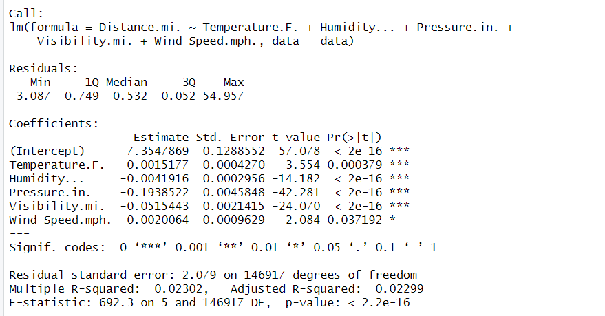
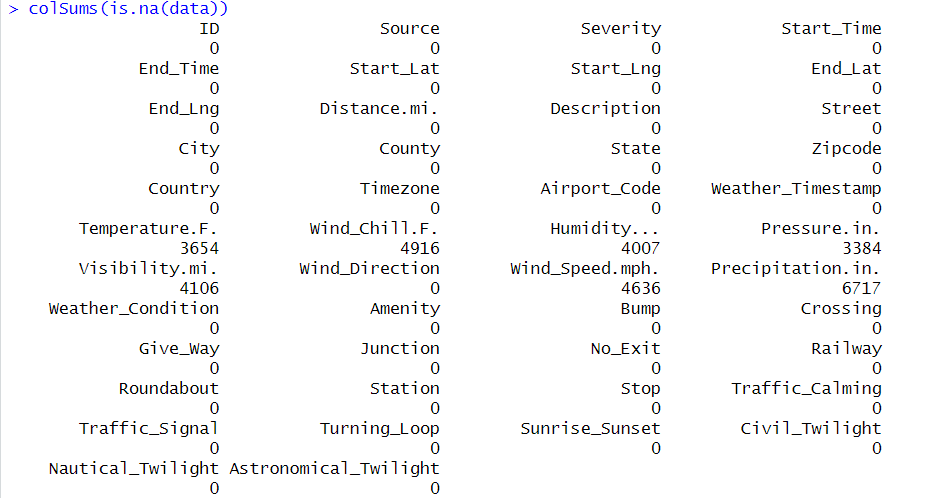

# Rstudio-Project-

# Traffic Accident Distance — EDA & Regression Modeling (US 2023)

This repository contains an Exploratory Data Analysis (EDA) and regression modeling project
focused on **traffic accident distance** (miles of roadway affected) using U.S. accident data
from 2023.

---

## 📄 Final Report
📘 **PDF Report**
- `SDS_301_REPORT (6) (2).pdf`

---

## 🧠 R Script
📜 **Main Analysis Code**
- `eda+model(res,qq)+evaluation+conf int (3).R`

This script includes:
- Data cleaning & missing value handling  
- Exploratory Data Analysis (EDA)  
- Regression models M1–M9  
- Residual & QQ diagnostics  
- Model evaluation and confidence intervals  

---

## 📊 Exploratory Data Analysis (EDA)

### Dataset Summary


### Missing Values


### Numerical Variable Distributions


### Correlation Matrix


### Target Variable: Distance


### Severity Overview


### Boxplots & Outliers


### Outlier Analysis


### Log Transformation


## 📈 Regression Models — Diagnostics

### Model 1 (M1)


### Model 2 (M2)


### Model 3 (M3)


### Model 4 (M4)


### Model 5 (M5)


### Model 6 (M6)


### Model 7 (M7)


### Model 8 (M8)


### Model 9 (M9)


## ▶️ How to Run the Code

```bash
Rscript "eda+model(res,qq)+evaluation+conf int (3).R"

